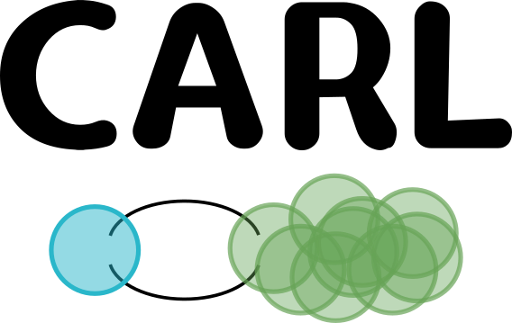
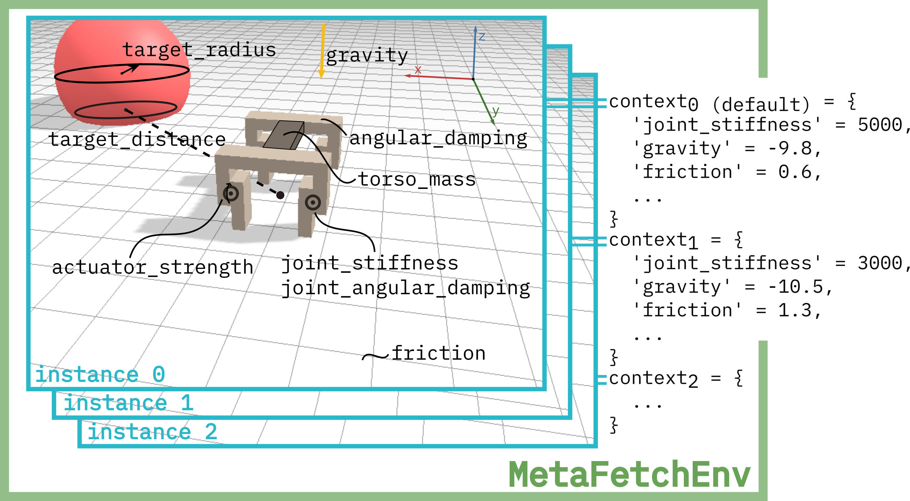

# – The Benchmark Library
[](https://pypi.python.org/pypi/carl-bench)
[](https://github.com/automl/carl/actions/workflows/tests.yaml)
[](https://github.com/automl/carl/actions/workflows/docs.yaml)
[](https://github.com/psf/black)

CARL (context adaptive RL) provides highly configurable contextual extensions
to several well-known RL environments.
It's designed to test your agent's generalization capabilities
in all scenarios where intra-task generalization is important.

Feel free to check out our [paper](https://arxiv.org/abs/2110.02102) and our short [blog post](https://www.automl.org/carl-a-benchmark-to-study-generalization-in-reinforcement-learning/)!

## Benchmarks
Benchmarks include:
- [OpenAI gym classic control suite](https://gym.openai.com/envs/#classic_control) extended with several physics context features like gravity or friction

- [OpenAI gym Box2D](https://gym.openai.com/envs/#box2d) BipedalWalker, LunarLander and
  CarRacing, each with their own modification possibilities like
  new vehicles to race

- All [Brax locomotion environments](https://github.com/google/brax) with exposed internal features like joint strength or torso mass

- [Super Mario (TOAD-GAN)](https://github.com/Mawiszus/TOAD-GAN), a procedurally generated jump'n'run game with control
  over level similarity

- [dm_control](https://github.com/deepmind/dm_control), environments based on the MuJoCo physics engine. The environments are extended with different context features.


For more information, check out our [documentation](https://automl.github.io/CARL/)!


## Installation
We recommend you use a virtual environment (e.g. Anaconda) to
install CARL and its dependencies. We recommend and test with python 3.9 under Linux.

First, clone our repository and install the basic requirements:
```bash
git clone https://github.com/automl/CARL.git --recursive
cd CARL
pip install .
```

This will only install the basic classic control environments, which should run on most operating systems. For the full set of environments, use the install options:
```bash
pip install -e ".[box2d,brax,dm_control,mario,rna]"
```

These may not be compatible with Windows systems. Box2D environment may need to be installed via conda on MacOS systems:
```bash
conda install -c conda-forge gym-box2d
```

In general, we test on Linux systems, but aim to keep the benchmark compatible with MacOS as much as possible.
RNA and Mario at this point, however, will not run on any operation system besides Linux.

To install ToadGAN for the Mario environment:
```bash
# System requirements
sudo apt install libfreetype6-dev xvfb
```

If you want to use RNA, please take a look at the associated [ReadME](carl/envs/rna/readme.md).

## CARL's Contextual Extension
CARL contextually extends the environment by making the context visible and configurable.
During training we therefore can encounter different contexts and train for generalization.
We exemplarily show how Brax' Fetch is extended and embedded by CARL.
Different instiations can be achieved by setting the context features to different values.



## Cite Us
If you use CARL in your research, please cite our paper on the benchmark:
```bibtex
@inproceedings { BenEim2023a,
  author       = {Carolin Benjamins and
                  Theresa Eimer and
                  Frederik Schubert and
                  Aditya Mohan and
                  Sebastian Döhler and
                  André Biedenkapp and
                  Bodo Rosenhahn and
                  Frank Hutter and
                  Marius Lindauer},
  title        = {Contextualize Me - The Case for Context in Reinforcement Learning},
  journal      = {Transactions on Machine Learning Research},
  year         = {2023},
}

```

## References
[OpenAI gym, Brockman et al., 2016. arXiv preprint arXiv:1606.01540](https://arxiv.org/pdf/1606.01540.pdf)

[Brax -- A Differentiable Physics Engine for Large Scale
Rigid Body Simulation, Freeman et al., NeurIPS 2021 (Dataset &
Benchmarking Track)](https://arxiv.org/pdf/2106.13281.pdf)

[TOAD-GAN: Coherent Style Level Generation from a Single Example,
Awiszus et al., AIIDE 2020](https://arxiv.org/pdf/2008.01531.pdf)

[dm_control: Software and Tasks for Continuous Control](https://arxiv.org/pdf/2006.12983.pdf)

## License
CARL falls under the Apache License 2.0 (see file 'LICENSE') as is permitted by all
work that we use. This includes CARLMario, which is not based on the Nintendo Game, but on
TOAD-GAN and TOAD-GUI running under an MIT license. They in turn make use of the Mario AI framework
(https://github.com/amidos2006/Mario-AI-Framework). This is not the original game but a replica,
explicitly built for research purposes and includes a copyright notice (https://github.com/amidos2006/Mario-AI-Framework#copyrights ).
