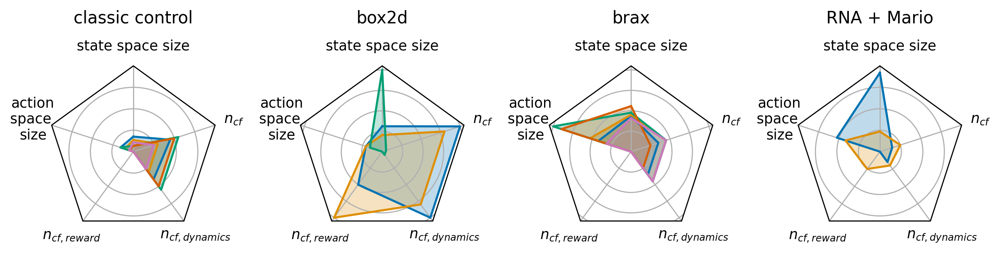

Benchmark Properties
====================
Below we discuss the properties of the CARL benchmarks which are summarized in the following Figure_.

.. _Figure:

State Space
-----------
Most of our benchmarks have vector based state spaces that can either be extended to include the context information or
not. The notable exceptions here are CARLVehicleRacing and CARLToadGAN, which exclusively use pixel-based observations.
The size of the vector based spaces range from only two state variables in the CARLMountainCar environments to 299
for the CARLHumanoid environment.

Action Space
------------
We provide both discrete and continuous environments, with six requiring discrete actions and the other ten continuous
ones. The number of actions can range from a single action to 19 different actions.

Quality of Reward
-----------------
We cover different kinds of reward signals with our benchmarks, ranging from relatively sparse step penalty style
rewards where the agent only receives a reward of -1 each step to complex composite reward functions in e.g. the
Brax-based environments. The latter version is also quite informative, providing updates on factors like movement
economy and progress towards the goal whereas the former does not let the agents distinguish between transitions
without looking at the whole episode. % this sentence could be dropped if space is needed
Further examples for sparse rewards are the CARLCartPoleEnv and CARLVehicleRacingEnv.

Context Spaces
--------------
While the full details of all possible context configurations can be seen in Environment Families. Here we
only discuss the differences between context spaces and the configuration possibilities they provide.
Depending on the environment the context features have different influence on the dynamics and the reward. Of all 131
registered context features, 98% influence the dynamics. This means that if a context feature is changed then the
transition from one state into the other is changed as well. Only 5% of the context features shape the reward.
Most context features (87%) are continuous, the rest is categorical or discrete.
With the explicit availability of context features CARL lends it self to study the robustness of agents by adding
noise on top of the specific context features. Further, the provided bounds and sampling distributions of the context
spaces that are provided as part of \CARL enable better comparability and reproducibility for future research efforts
in the realm of general RL agents.

