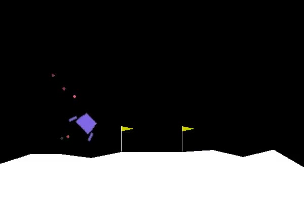
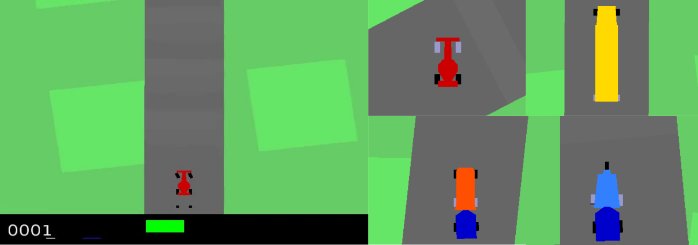

CARL Box 2D Environments
========================

`OpenAI's gym Box2D <https://gymnasium.farama.org/environments/box2d/>`_ provides environments for continuous control tasks.
In CARL BipedalWalker, LunarLander and CarRacing are included, each with their own modification possibilities like
new vehicles to race.

CARL BipedalWalker Environment
------------------------------
.. image:: ../data/screenshots/bipedalwalker.jpeg
    :width: 25%
    :align: center
    :alt: Screenshot of CARLBipedalWalkerEnv

In BipedalWalker a bipedal robot is trained to walk.
The properties of the walker's body, surroundings and physics as well as the simulation dynamics
can be varied via the context features.

.. csv-table:: Defaults and Bounds
   :file: ../data/context_definitions/CARLBipedalWalkerEnv.csv
   :header-rows: 1

CARL LunarLander Environment
------------------------------

Here, the lunar lander should be safely navigated to its landing pad.
The lander's body, physics and simulation dynamics can be manipulated via the context features.

.. csv-table:: Defaults and Bounds
   :file: ../data/context_definitions/CARLLunarLanderEnv.csv
   :header-rows: 1

CARL VehicleRacing Environment
------------------------------

In this environment a vehicle is raced around a track. The context here is the type of vehicle.
There are different types of vehicles, race car, street car, bus and vehicle, and most of them can have a front-, back-
or all-wheel drive as well as small or large trailers (29 variations in total).

.. csv-table:: Defaults and Bounds
   :file: ../data/context_definitions/CARLVehicleRacingEnv.csv
   :header-rows: 1