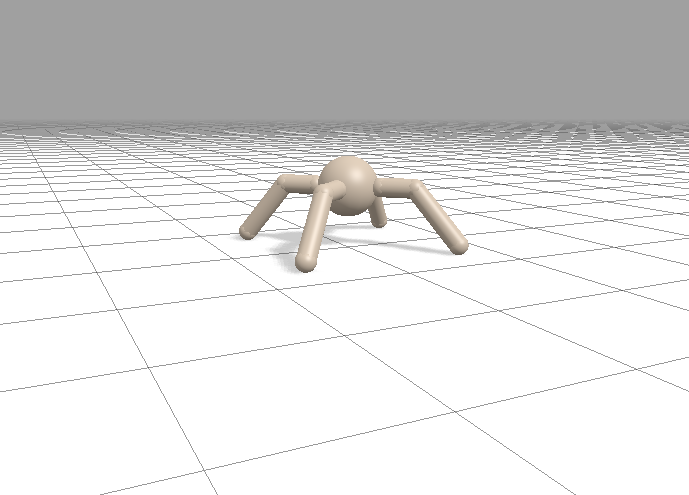
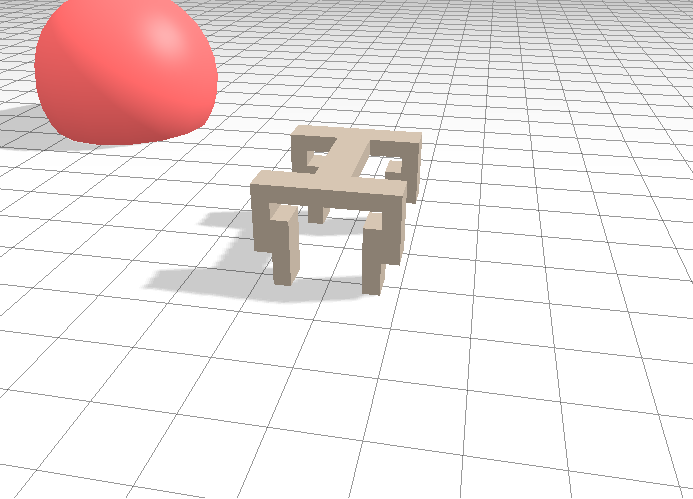
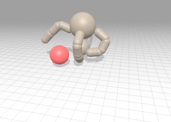
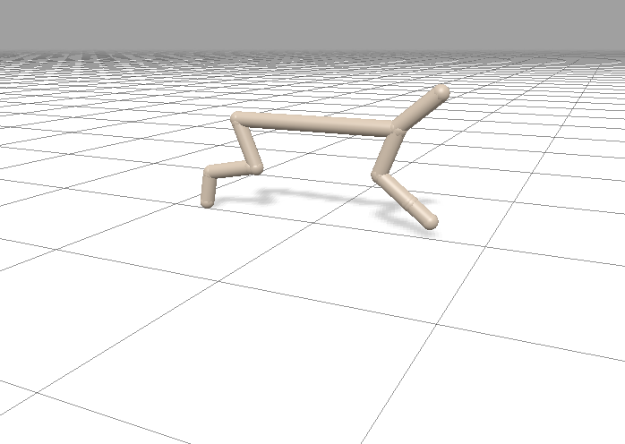
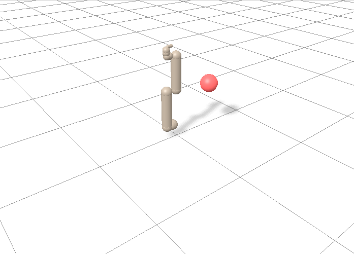

CARL Brax Environments
######################
In CARL all `Brax locomotion environments <https://github.com/google/brax>`_ are included.
As context features there are external features like gravity or friction or internal features
like joint strength or torso mass.

CARL Ant Environment
***************************

Here the agent needs to learn how to control a four-legged ant in order
to run (quickly) into one direction.

.. csv-table:: Defaults
   :file: ../data/context_defaults/CARLAnt.csv
   :header-rows: 1

.. csv-table:: Bounds
   :file: ../data/context_bounds/CARLAnt.csv
   :header-rows: 1

CARL Fetch Environment
**********************

Fetch trains a dog to run to a target location.
The target radius and distance as well as physical properties can be varied via the context features.

.. csv-table:: Defaults
   :file: ../data/context_defaults/CARLFetch.csv
   :header-rows: 1

.. csv-table:: Bounds
   :file: ../data/context_bounds/CARLFetch.csv
   :header-rows: 1

CARL Grasp Environment
**********************

In CARL Grasp the agent is trained to pick up an object.
Three bodies are observed by Grasp: 'Hand', 'Object', and 'Target'.
When Object reaches Target, the agent is rewarded.
Apart from Grasp's pyhiscal properties the target radius, height and distance are also varied.

.. csv-table:: Defaults
   :file: ../data/context_defaults/CARLGrasp.csv
   :header-rows: 1

.. csv-table:: Bounds
   :file: ../data/context_bounds/CARLGrasp.csv
   :header-rows: 1

CARL Halfcheetah Environment
**********************

A Halfcheetah is trained to run in the +x direction.
The context features can vary physical properties.

.. csv-table:: Defaults
   :file: ../data/context_defaults/CARLHalfcheetah.csv
   :header-rows: 1

.. csv-table:: Bounds
   :file: ../data/context_bounds/CARLHalfcheetah.csv
   :header-rows: 1

CARL Humanoid Environment
**********************
.. image:: ../data/screenshots/humanoid.png
    :width: 200px
    :align: center
    :alt: Screenshot of CARLHumanoid

Here, a Humanoid needs to learn how to run in the +x direction.

.. csv-table:: Defaults
   :file: ../data/context_defaults/CARLHumanoid.csv
   :header-rows: 1

.. csv-table:: Bounds
   :file: ../data/context_bounds/CARLHumanoid.csv
   :header-rows: 1

CARL UR5e Environment
**********************

The agent needs to learn how to move a ur5e robot arm and its end effector to a sequence of targets.
The robot arm has 6 joints.

.. csv-table:: Defaults
   :file: ../data/context_defaults/CARLUr5e.csv
   :header-rows: 1

.. csv-table:: Bounds
   :file: ../data/context_bounds/CARLUr5e.csv
   :header-rows: 1