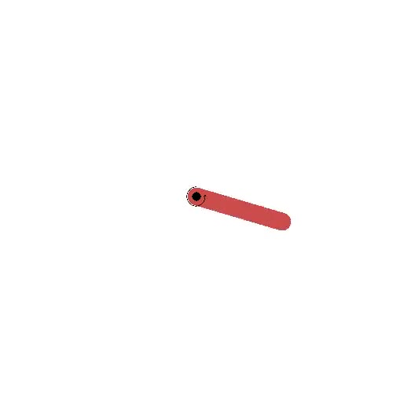

CARL Classic Control Environments
=================================

Classic Control is a problem suite included in `OpenAI's gym <https://gymnasium.farama.org/environments/classic_control/>`_ consisting
of simply physics simulation tasks. Context features here are therefore
also physics-based, e.g. friction, mass or gravity.

CARL Pendulum Environment
-------------------------

In Pendulum, the agent's task is to swing up an inverted pendulum and
balance it at the top from a random position. The action here is the
direction and amount of force the agent wants to apply to the pendulum.

.. csv-table:: Defaults and Bounds
   :file: ../data/context_definitions/CARLPendulumEnv.csv
   :header-rows: 1

CARL CartPole Environment
-------------------------
.. image:: ../data/screenshots/cartpole.jpeg
    :width: 25%
    :align: center
    :alt: CartPole Environment

CartPole, similarly to Pendulum, asks the agent to balance a pole upright, though
this time the agent doesn't directly apply force to the pole but moves a cart on which
the pole ist placed either to the left or the right.

.. csv-table:: Defaults and Bounds
   :file: ../data/context_definitions/CARLCartPoleEnv.csv
   :header-rows: 1

CARL Acrobot Environment
-------------------------
.. image:: ../data/screenshots/acrobot.jpeg
    :width: 25%
    :align: center
    :alt: Acrobot Environment

Acrobot is another swing-up task with the goal being swinging the end of the lower
of two links up to a given height. The agent accomplishes this by actuating
the joint connecting both links.

.. csv-table:: Defaults and Bounds
   :file: ../data/context_definitions/CARLAcrobotEnv.csv
   :header-rows: 1

CARL MountainCar Environment
----------------------------
.. image:: ../data/screenshots/mountaincar.jpeg
    :width: 25%
    :align: center
    :alt: MountainCar Environment

The MountainCar environment asks the agent to move a car up a steep slope. In order
to succeed, the agent has to accelerate using the opposite slope. There are two
versions of the environment, a discrete one with only "left" and "right" as actions,
as well as a continuous one.

Defaults and bounds for the discrete MountainCar:

.. csv-table:: Defaults and Bounds
   :file: ../data/context_definitions/CARLMountainCarEnv.csv
   :header-rows: 1

And for the continuous case:

.. csv-table:: Defaults and Bounds
   :file: ../data/context_definitions/CARLMountainCarContinuousEnv.csv
   :header-rows: 1
