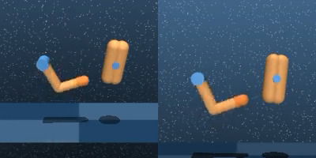
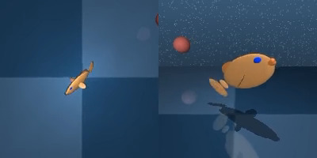
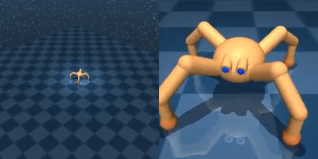
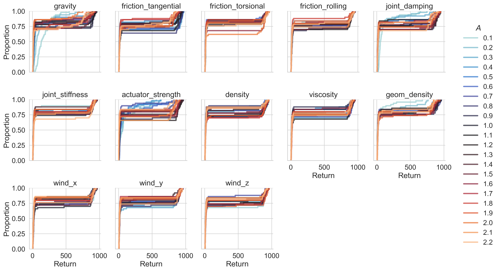
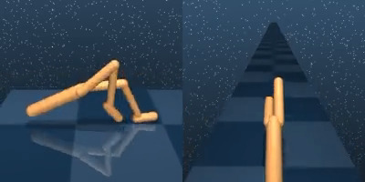
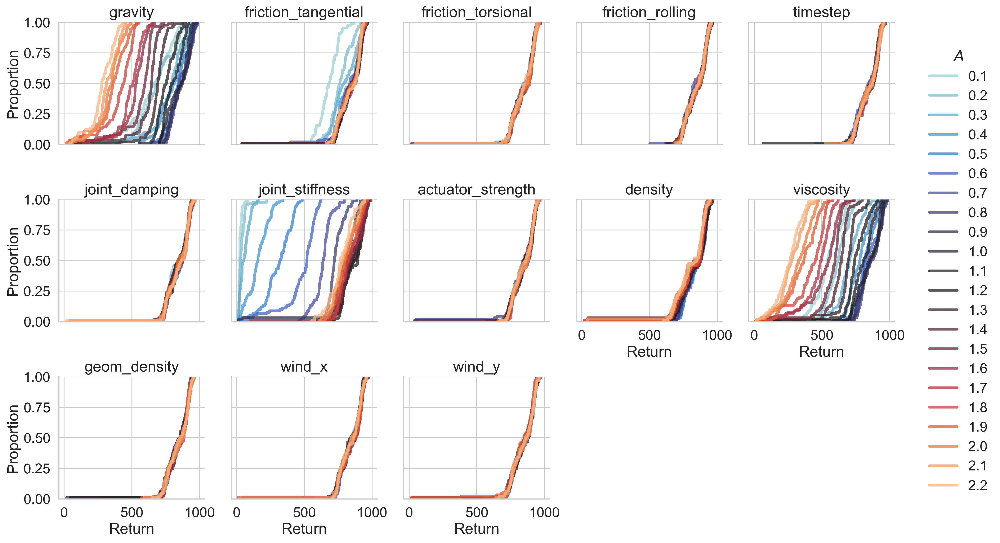

CARL DMC Environments
######################
CARL includes the Finger, Fish, Quadruped and Walker environments from the `DeepMind Control Suite <https://github.com/deepmind/dm_control>`_.
The context features control the MuJoCo physics engine, e.g. the floor friction.

CARL DMC Finger Environment
***************************

The agent needs to learn to spin an object using the finger.

.. csv-table:: Defaults and Bounds
   :file: ../data/context_definitions/CARLDmcFinger.csv
   :header-rows: 1

CARL DMC Fish Environment
**********************

In Fish, the agent needs to swim as a simulated fish.

.. csv-table:: Defaults and Bounds
   :file: ../data/context_definitions/CARLDmcFish.csv
   :header-rows: 1

CARL DMC Quadruped Environment
**********************

:raw-html:` `
The agent's goal is to walk efficiently with the quadruped robot.

.. csv-table:: Defaults and Bounds
   :file: ../data/context_definitions/CARLDmcQuadruped.csv
   :header-rows: 1

CARL DMC Walker Environment
*****************************

The walker robot is supposed to move forward as fast as possible.

.. csv-table:: Defaults and Bounds
   :file: ../data/context_definitions/CARLDmcWalker.csv
   :header-rows: 1