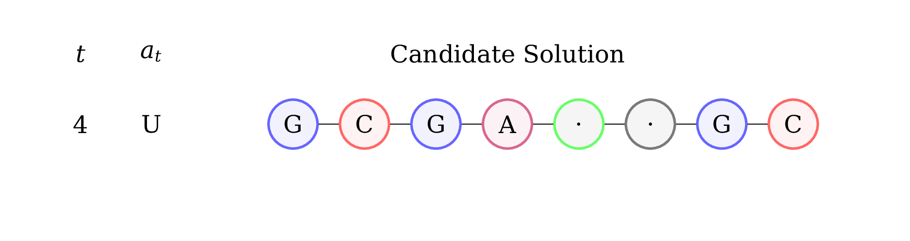

CARL RNA Design Environment
===========================
.. warning::
    This environment currently is under maintenance and cannot be installed. Thank you for your patience.

In the LeaRNA RNA Design Environment, the agent attempts to design a RNA sequence
that matches given structural constraints. This is a very challenging problem
due to the complex underlying dynamics of biological processes as well as the wealth
of variation contained in the real world data provided.

.. csv-table::
   :file: ../data/context_definitions/CARLRnaDesignEnv.csv
   :header-rows: 1
