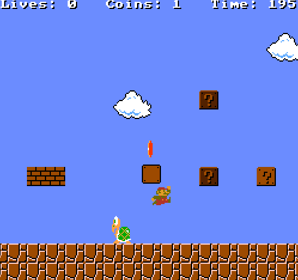

CARL ToadGAN Environment
========================

The ToadGAN environment provides context-guided procedural generation inspired by
Nintendo's super Mario Bros. The agent has to guide a character through levels
generated according to context definition, including jumps, coins and enemies.
The level is solved as soon as the agent arrives at the end. Its actions include
moving forwards or backwards and jumping.

The generation can be controlled by the following context features:
.. csv-table:: Defaults and Bounds
   :file: ../data/context_definitions/CARLMarioEnv.csv
   :header-rows: 1