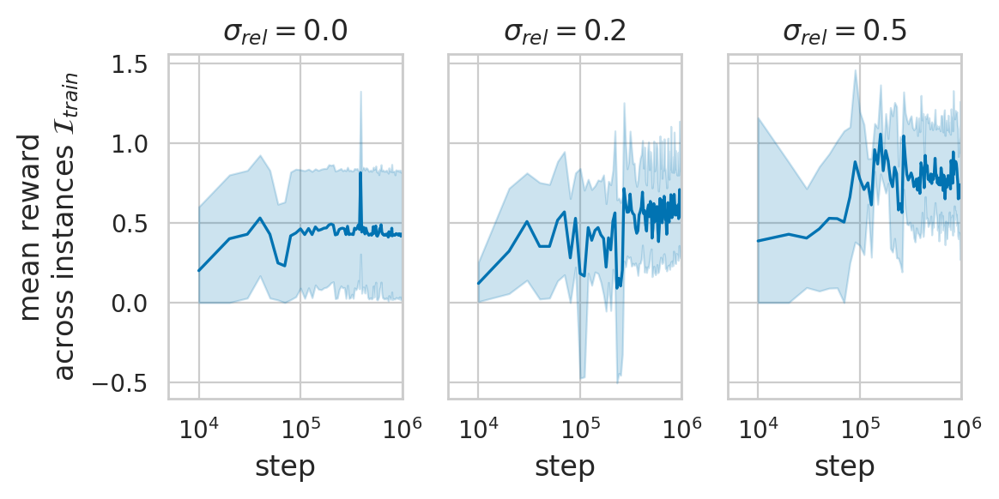
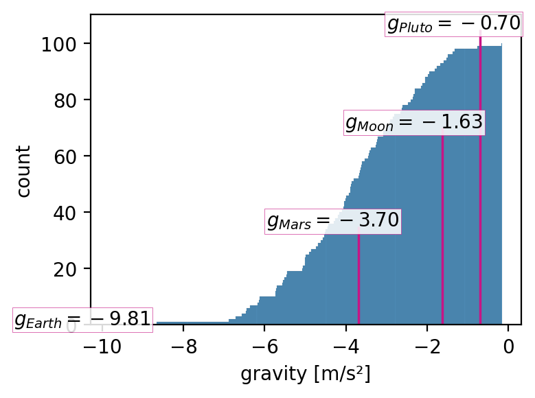
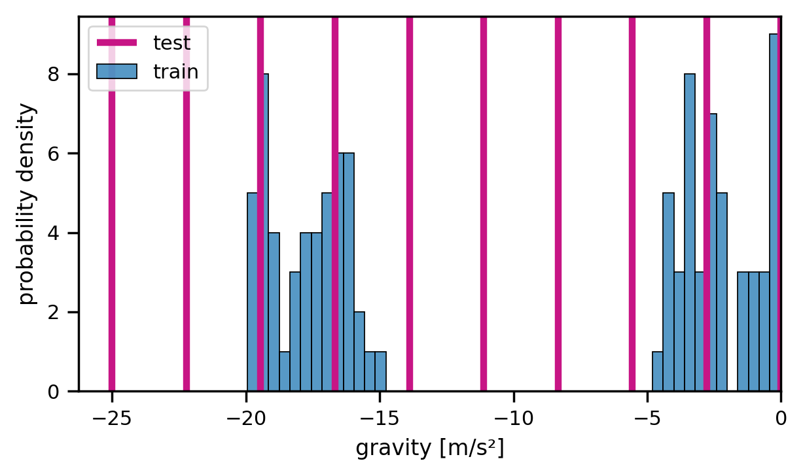
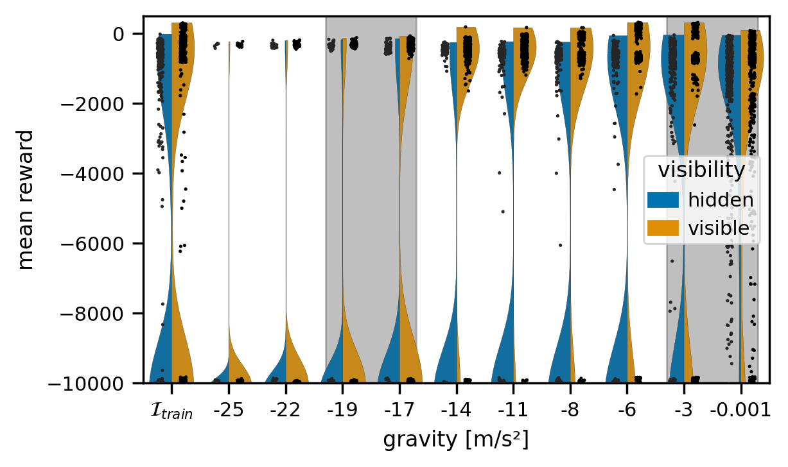

.. _experiments:

===============
Experiments
===============
Here we provide further experiments.

CARL on Mario
=============
In order to confirm that our results scale up to our more complex environments, we train a `PPO <https://arxiv.org/pdf/1707.06347.pdf>`_ agent on our *ToadGAN Mario* (`Super Mario (TOAD-GAN) <https://github.com/Mawiszus/TOAD-GAN>`_) environment.
One context feature that heavily influences the dynamics in CARLMarioEnv environment is the inertia of Mario.
In the Figure below, we see that a higher variation of the inertia improves the performance of the PPO agent and leads to faster training.
This effect can be explained by the influence of Mario's inertia on the exploration of the agent (i.e. a lower inertia makes it easier for the agent to move).

Policy Transfer for LunarLander (Two-Interval Distribution)
===========================================================
In the main paper we analyzed acting on in-distribution and out-of-distribution instances.
For this we vary the context feature 'gravity' for CARLLunarLanderEnv which extends `gym's <https://gym.openai.com/envs/#box2d>`_'s LunarLander. In the first experiment we defined our training distribution as a Gaussian distribution, see Figure below for the actual gravity values used for training.

Now, we trained our agent on 5 random seeds on 100 contexts distributed on two gravity intervals, :math:`[-15m/s², -10m/s²]` and :math:`[-5m/s², -0.001m/s²]`.

In one case we hid the context from the agent, in the other case the context was visible.
For the latter, we only added the changing context feature, i.e. the gravity, to the state.
In general, providing the context shows a clear benefit: The agent reaches a higher reward in all cases, see Figure below.

Furthermore, we can observe that with an higher magnitude of gravity the difficulty also increases.
That is the case because the agent has less time to act before reaching the ground if the gravity increases.
In addition, if we compare the performance on the gravities :math:`[-14m/s², -11m/s²]` (in-distribution) to the performance on :math:`[-8m/s², -6m/s²]` (out-of-distribution) we notice more crashes on the out-of-distribution case.

