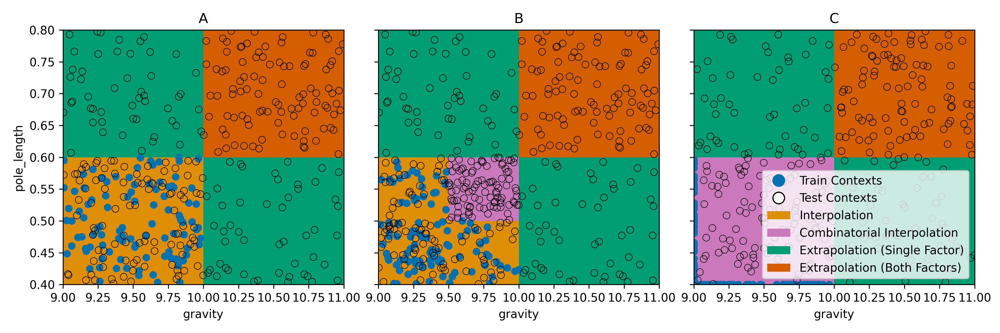

# Evaluation Protocols

This folder contains scripts for training and evaluating a cMDP according to three
different evaluation protocols [[A survey of Generalisation in Deep Reinforcement Learning, Kirk et al., CoRR 2021](https://arxiv.org/pdf/2111.09794.pdf)].

## Modes
Following Kirk et al., there are three different evaluation protocols.
For simplicity, only two dimensions are depicted.
The train and test distribution are generated for gravity and pole length of CARLCartPoleEnv
(same as in the experiment) and for seed 1.

The image has been generated with `plot_traintest_distributions.py`.

## Rerun Experiments
If you would like to rerun the experiments, take a look at the `runscripts` folder.
The run commands are generated such that they can be easily parallelized. 

For retraining, run `runscripts/run_train_evaluation_protocol.sh`.
Maybe the paths need to be adjusted, in that case you can regenerate all run commands
via `runscripts/generate_train_commands.py`.

Evaluating works accordingly: Adjust the paths in `runscripts/generate_eval_commands.py` to your
needs and run the resulting `.sh`-file.