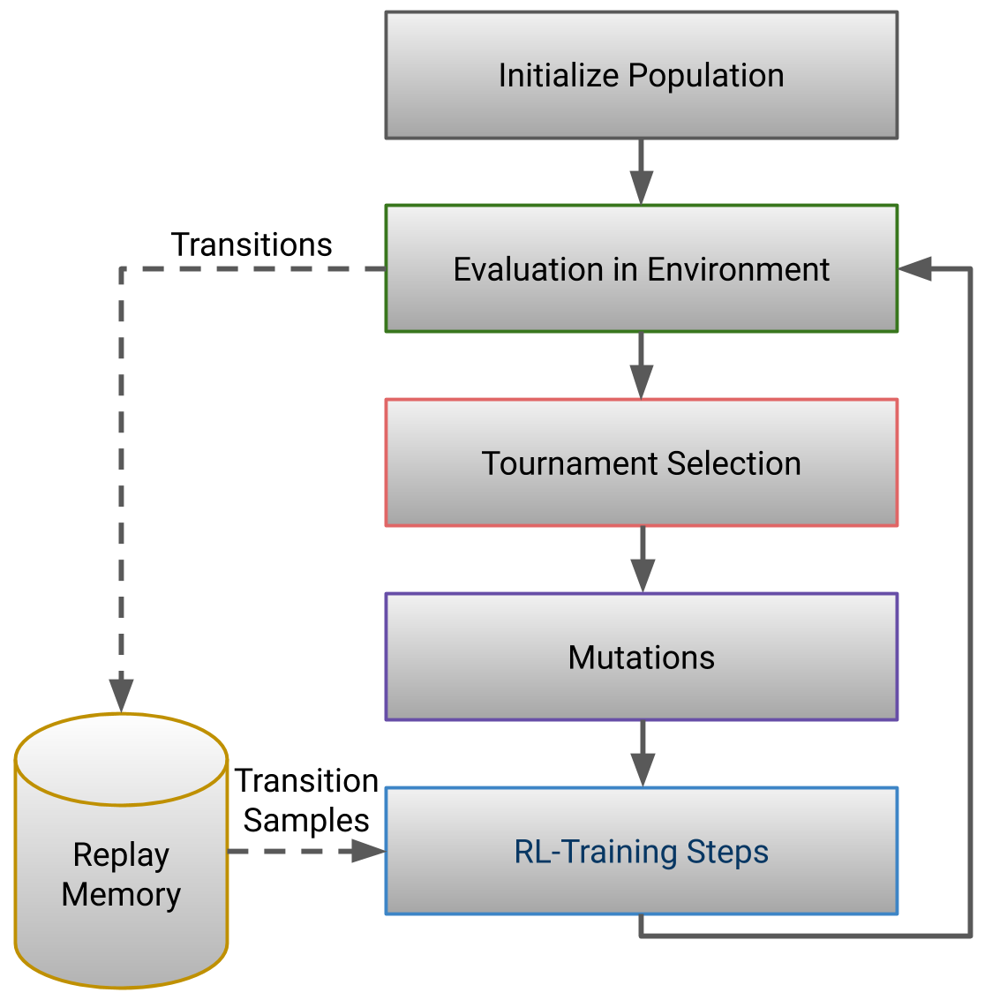

# Sample-Efficient Automated Deep Reinforcement Learning

[](https://www.python.org/downloads/release/python-3611/)
[](https://pytorch.org/)

This repository contains source code accompanying the ICLR 2021 publication:

> [Sample-Efficient Automated Deep Reinforcement Learning](https://openreview.net/forum?id=hSjxQ3B7GWq)  
> Jörg K.H. Franke, Gregor Koehler, André Biedenkapp, Frank Hutter \
> In *Proceedings of the International Conference on Learning Representations (ICLR 2021)*, 2021.

Sample-Efficient Automated Deep Reinforcement Learning (SEARL) jointly trains an RL off-policy agent and optimized the
hyperparameters including the neural networks architecture. SEARL uses a population of agents with different
hyperparameters and an evolutionary outer loop (Figure below) similar to PBT. During evaluation, each
agent/hyperparameter combination gets a fitness score and the environment interactions are stored as transitions in an
shared replay memory. Based on the fitness score, the best agent/hyperparameter combinations are selected, the
hyperparameters are mutated and trained with samples from a shared replay memory and afterwards evaluated again. The
population in SEARL benefits from a diverse set of experience in the shared replay memory. SEARL trains an RL agent and
jointly finds optimal hyperparameters and neural architectures with up to ten times less environment interactions as
random search or PBT.    



SEARL allows training an agent and simultaneously automatically tuning the hyperparameters with nearly the same amount
of environment steps. For a fair evaluation we introduce a new evaluation protocol considering all
environment interactions during an algorithms HPO.


## Usage


### Requirements

The source code is tested on Linux with Python 3.6. Please install the `requirements.txt` and make sure your have 
MuJoCo version 2.0 binaries in your home folder as well as a valid licence. 
You can obtain a 30-day free trial licence on the [MuJoCo website](https://www.roboti.us/license.html).
The license key will arrive in an email with your username and password. You can download the MuJoCo version 2.0 
binaries for [Linux](https://www.roboti.us/download/mujoco200_linux.zip). Please unzip the downloaded `mujoco200` 
directory into `~/.mujoco/mujoco200`, and place your license key (the `mjkey.txt` file from your email)
at `~/.mujoco/mjkey.txt`.

Please find help in case of any install issues at [openai/mujoco-py](https://github.com/openai/mujoco-py), in the 
[full documentation](https://openai.github.io/mujoco-py/build/html/index.html) or in the 
[mujoco-py issues scetion](https://github.com/openai/mujoco-py/issues).

### Run experiments

Please find in the `scripts` folder run scripts for the RL experiments on TD3 and DQN as well as SEARL experiments on 
TD3 and DQN.  By default, the script loads the configuration for the experiment from the `configs` folder. You can also 
start with a custom config or experiment directory by using the `--config_file` or `--expt_dir` argument.

## Cite

If you use this code in your own work, please cite SEARL using the following bibtex entry:

```
@inproceedings{franke2020searl,
  title={Sample-Efficient Automated Deep Reinforcement Learning},
  author={Franke, J{\"o}rg KH and K{\"o}hler, Gregor and Biedenkapp, Andr{\'e} and Hutter, Frank},
  booktitle={International Conference on Learning Representations},
  year={2021},
}
```
